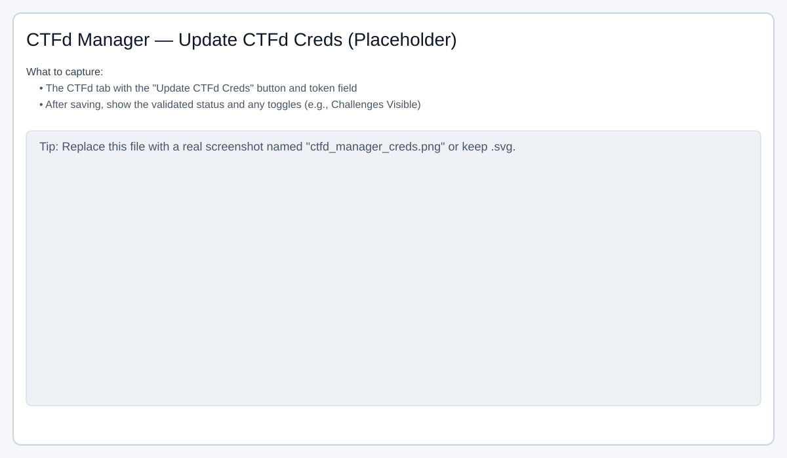
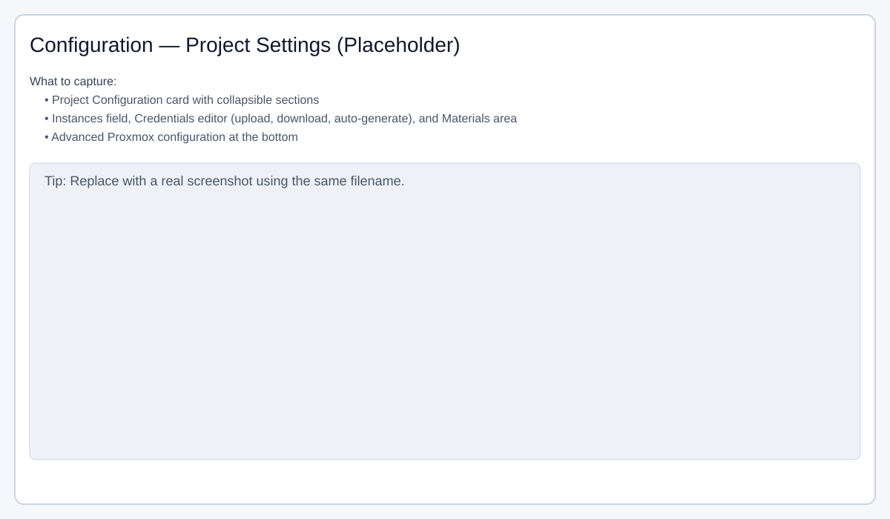
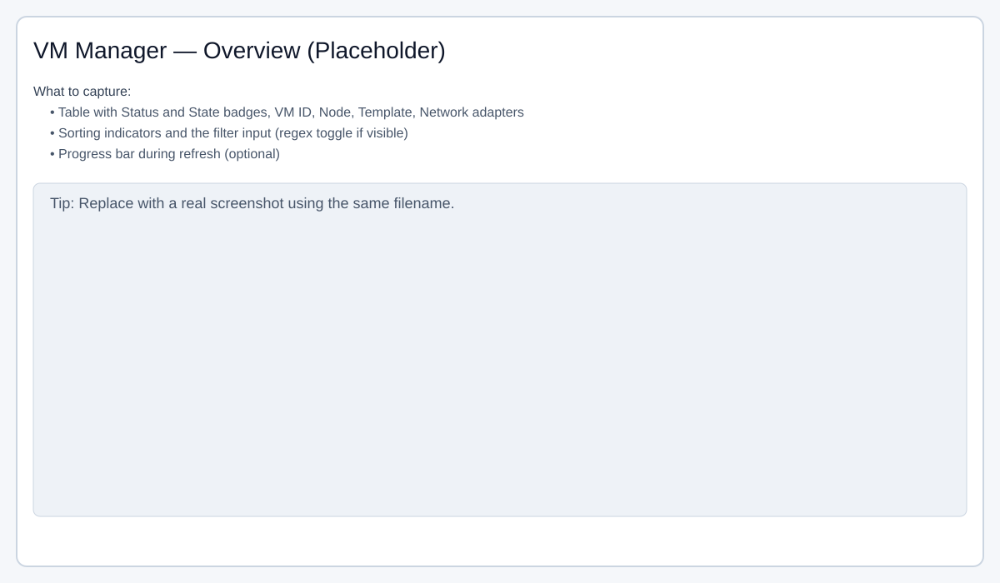
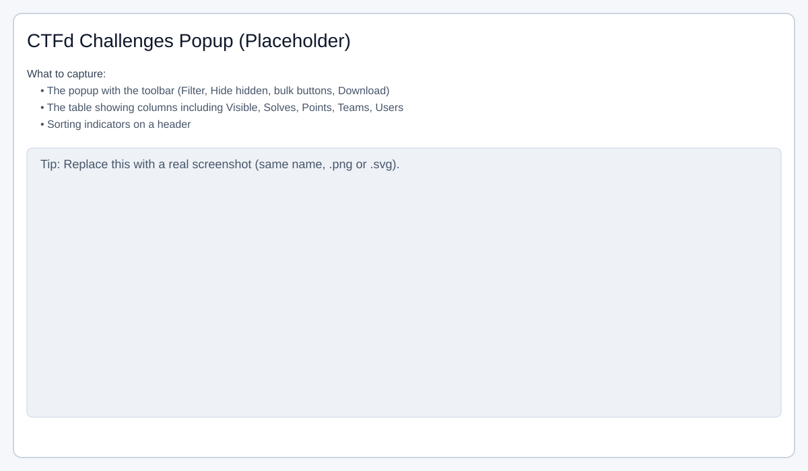
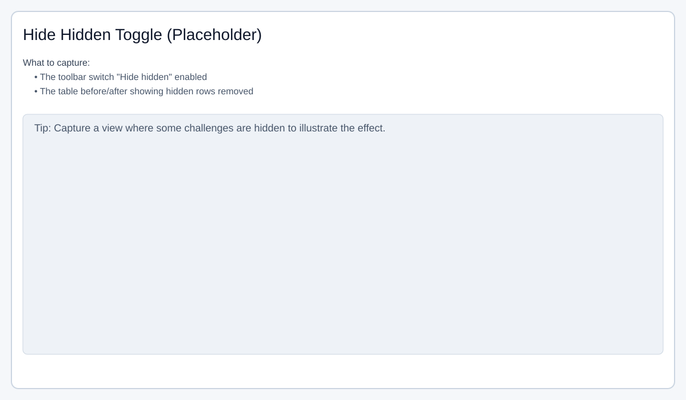
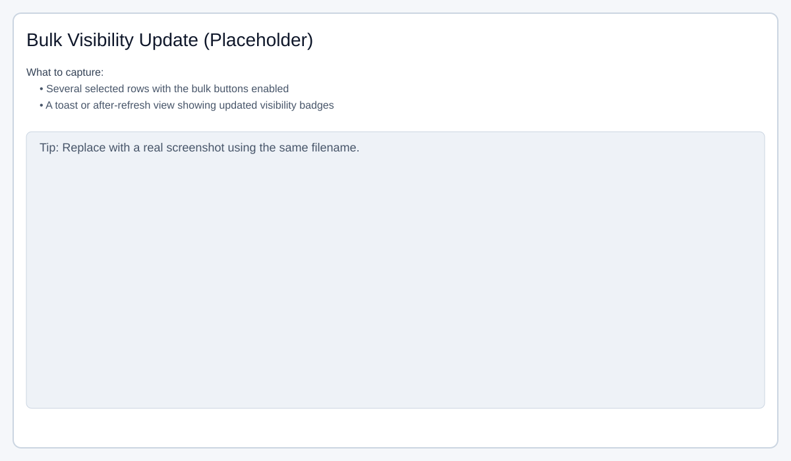

# Acosta Network Scenario Setup System (AN3S)

AN3S (formerly N3S) is a simple, Dockerized web GUI for configuring networked CTF/scenario projects and interacting with Proxmox and CTFd via REST APIs. It provides a Bootstrap-based frontend to manage Projects, Virtual Machines, Materials, and per-instance Credentials, with import/export and connector calls.

## Features

- Project-centric “Configuration” UI with collapsible sections and remembered state
- Virtual Machines editor (inline rename, per-VM collapsibles, dynamic lists)
- Materials upload/download/delete with persistent storage
- Credentials editor (username/password pairs) with:
	- CSV upload and download
	- Auto-generate to exactly match “Instances” (8-char uppercase passwords)
	- Live validation/sanitization and button enable/disable
	- Always enforces credentials count equals Instances: pad missing or truncate extras
	- Confirmation prompts on Upload and Auto-generate
- Advanced Proxmox configuration at the bottom
- Import/Export projects as zip (single or multi-project manifest)
- Proxmox and CTFd connector calls
- Dockerized (gunicorn) + local dev server

### CTFd Manager & Challenges popup

- Token-first CTFd integration with session (cookie) fallback; upstream errors surfaced with hints
- Manager: Update CTFd base URL/port and API token, toggle global visibility (where supported)
- Challenges popup (opens from CTFd Manager → "Challenges"):
	- Sorting and per-column indicators
	- Filter across all columns (name, category, solves, points, visibility label, team/user names and counts)
	- Toggle: Regex filter mode (invalid patterns fall back to plain text); state persisted per project
	- Visibility column with badge (Visible/Hidden/Unknown)
	- Row selection with bulk Set Visible/Hidden and per-row Show/Hide actions
	- CSV export includes visibility
	- Toggle: "Include Hidden" to include or exclude hidden rows (checked = show hidden)
	- Toggle: "Detailed Solves" for full detail vs fast counts-only mode
	  	- When off (fast mode): Teams/Users show "n/a" and are not fetched; progress displays "Fetching x of y" and updates smoothly without jumping
	  	- When on: now performs a single bulk stats request (detail=true) for all challenges (significantly fewer network calls); automatically falls back to legacy per‑challenge requests only if the bulk endpoint fails
	- Teams / Users columns have inline header toggles ("(expand)/(collapse)") that persist expansions across refreshes for the current session
	- Monotonic progress bar (never regresses) in both fast and detailed modes
	- UI state (sort, filter text, regex toggle, Include Hidden, Detailed Solves, column visibility, expansion sets) persisted per project (sessionStorage)

### VM Manager highlights

- One row per VM (credentials grouped by instance)
- State badges mapped from Proxmox power states (running, starting, suspended, stopped, error, …)
- Per-VM Status: created/missing derived from backend match; not group-wide
- Shows VM ID, Node, Template name/ID (best-effort), and Network adaptors
- Sortable columns: Status, State, ID, Node, Template; visual sort indicators
- Filter supports plain text or regex (toggle with inline invalid-regex message)
- Progress bar during refresh

### Validation and data hygiene

- Client-side and server-side validation for Tags and VM Names: VM names allow letters, numbers, and internal dashes (no leading/trailing dash); Tags allow letters and dashes
- VM config supports optional VM ID (vmid) per VM; backend matches by vmid first, then name (case-insensitive fallback)
- Import sanitizes tags and VM names and reports validation errors per project

## Quick start (Docker)

Prerequisites: Docker and Docker Compose

```bash
#!/usr/bin/env bash
# From repo root
docker compose up --build
# App serves at http://localhost:8080
```

Compose configuration:
- Service: toolhub
- Port: 8080 → 8080
- Volume: named `toolhub-data` mounted at `/data` (persistent projects/materials)
- Env: `PORT=8080`, `DATA_DIR=/data`

# SetupCyberExercises

...existing content...

## Local development (Flask dev server)

Use Python 3.12+.

```bash
#!/usr/bin/env bash
# Optional: create a venv
python3 -m venv .venv
source .venv/bin/activate

pip install -r requirements.txt

# Choose a local data directory for persistence
export DATA_DIR="$(pwd)/.data"

# Run the dev server (package mode so relative imports work)
python -m app
# App serves at http://localhost:8080 (debug mode)
```

## Local development

This app now supports running via `python -m app` with sensible defaults:

- DATA_DIR: The app writes project data and materials to a writable directory.
	- If the `DATA_DIR` env var is set and writable, it will be used.
	- Otherwise, it falls back to `./data` inside the project root.
	- As a last resort, it uses a temp folder (e.g., `/tmp/toolhub-data`).

- PORT: The dev server will pick an available port automatically (prefers 8080, then 8081, 5000, 5001). You can force a port by setting the `PORT` env var.

### Quick start (macOS, zsh)

```zsh
# optional: choose a port and data directory
export PORT=8081
export DATA_DIR="$(pwd)/data"

python -m app
```

Then open the URL printed in the terminal (e.g., http://127.0.0.1:8081/).

### VS Code task

If you prefer a fixed port via a task, update or create a task with:

```jsonc
{
	"label": "Run Flask dev server (fixed port)",
	"type": "shell",
	"command": "PORT=8081 DATA_DIR=\"${workspaceFolder}/data\" python -m app",
	"isBackground": false,
	"group": "build"
}
```

This avoids conflicts when port 8080 is already in use.
Notes:
- Running `python app/__init__.py` directly won’t work due to package-relative imports. Always use `python -m app` for dev or `gunicorn app.wsgi:app` for prod.

## Configuration

Environment variables:
- `DATA_DIR`: directory for JSON storage and materials (default `/data`)
- `PORT`: port to serve (Docker uses 8080 via gunicorn)

## Local development (Waitress)

Run with a production WSGI server (Waitress) for stable behavior outside Docker:

```bash
python -m app
```

This uses Waitress and listens on `0.0.0.0:${PORT:-8080}`.
In-app Project fields include Proxmox/Guacamole/Keycloak/Challenge URLs and ports, Instances count, Tag, and Advanced Proxmox paths/options.

## Using the UI

Open http://localhost:8080

- Projects list: create/rename/delete, export
- Configuration (collapsible):
	- Set Instances; UI auto-harmonizes credentials to match
	- Credentials:
		- Upload list with two columns: username,password (comma- or space-separated) → replaces and adjusts to Instances
		- Auto-generate → generates exactly Instances with 8-char uppercase passwords
		- Add Row is disabled when count reaches Instances; removing rows will auto-fill back to Instances
		- Download CSV is enabled only when at least one row has a valid username and an 8+ char password
- Virtual Machines: add/remove VMs; edit details in per-VM collapsibles
- Materials: upload/download/delete files; stored under `DATA_DIR/materials`
- Advanced: Proxmox configuration fields at the end of the card

State persistence: section expand/collapse states are remembered per project.

## Import/Export

- Export a single project from its card or use the multi-export endpoint
- Import accepts a zip with a `project.json` manifest (schemaVersion=1). Materials are included under `materials/` paths.

## API overview

Base path: `/api`

- Health: `GET /api/health`
- Projects: `GET /api/projects`, `POST /api/projects`
- Project update/delete: `PATCH /api/projects/{id}`, `DELETE /api/projects/{id}`
- Export single: `GET /api/projects/{id}/export`
- Export multiple: `GET /api/projects/export?ids=a,b&includeMaterials=true`
- Import: `POST /api/projects/import` (multipart file `file`)
- VMs: `POST /api/projects/{id}/vms`, `DELETE /api/projects/{id}/vms/{name}`, `PATCH /api/projects/{id}/vms/{name}`, `POST /api/projects/{id}/vms/{name}/rename`
- Materials: `GET /api/projects/{id}/materials`, `POST /api/projects/{id}/materials`, `GET /api/projects/{id}/materials/{fname}`, `DELETE /api/projects/{id}/materials/{fname}`
- Connectors:
	- Proxmox nodes: `POST /api/proxmox/nodes` { baseUrl, token, verifySSL }
	- CTFd challenges (simple): `POST /api/ctfd/challenges` { baseUrl, token }

CTFd project-scoped endpoints (require Admin/Teacher token for full functionality):
- `POST /api/projects/{pid}/ctfd/login` — Validate API token or session
	- Body: `{ baseUrl, port?, token?, username?, password?, verifySSL? }`
	- Returns: `{ ok, using_token, role?, logs? }`
- `POST /api/projects/{pid}/ctfd/stats/challenges` — Fetch challenges with visibility and solves
	- Body: `{ baseUrl, port?, token?, username?, password?, verifySSL? }`
	- Returns: `{ items: [ { id, name, category, points, solves, teams, users, visible } ], using_token, logs }`
- `POST /api/projects/{pid}/ctfd/challenges/visibility` — Bulk update visibility
	- Body: `{ baseUrl, port?, token?, username?, password?, verifySSL?, ids: number[], visible: boolean }`
	- Returns: `{ ok, updated: [ { id, state } ], errors: [ { id, error } ], using_token, logs }`

Credentials payload shape:
```json
{
	"credentials": [
		{ "username": "alice", "password": "PASSWORD123" },
		{ "username": "bob",   "password": "" }
	]
}
```
Validation: username non-empty; if password is provided it must be at least 8 characters. The UI and save flow ensure credentials list length equals Instances (auto-fill/truncate).

## Project structure

- `app/` Flask application
	- `routes/api.py` REST endpoints
	- `storage/` JSON persistence layer
	- `connectors/` demo Proxmox and CTFd clients
	- `static/` Bootstrap UI (index.html, js, css)
	- `wsgi.py` gunicorn entrypoint
- `Dockerfile`, `docker-compose.yml` containerization
- `requirements.txt` Python deps

## Troubleshooting

- Import errors when running `app/__init__.py` directly: run `python -m app` instead (ensures package-relative imports work).
- Permissions on data directory: ensure `DATA_DIR` exists and is writable. Docker compose uses a named volume mapped to `/data`.
- Invalid credentials on upload: CSV must be two columns: `username,password`. Passwords must have at least 8 characters if present.
 - Invalid credentials on upload: Provide two columns: `username password` or `username,password`. Passwords must have at least 8 characters if present.

CTFd-specific:
- For admin-only listings (to include hidden challenges), use an Admin or Teacher API token in the CTFd Manager.
 - The Challenges popup reads the token from sessionStorage; to work in a popup without `window.opener`, it mirrors the token into a same-origin session cookie keyed by project id. The token is not persisted on the server.
 - Use the "Include Hidden" toggle to show hidden items; enable "Regex" to match by regular expressions; disable "Detailed Solves" for faster counts-only mode (Teams/Users will display "n/a"). Progress remains smooth and monotonic.
 - Detailed mode optimization: one bulk stats call (detail=true) replaces N per‑challenge calls; automatic fallback to per‑challenge worker pool if bulk fails (older server / permission issues).
 - Expansion state of Teams/Users detail sections is sticky per project.

CTFd Manager optimization:
- User metadata (existence, ranks, last solves, team info) now fetched via a single bulk `users_check` request instead of one request per credential username.
- If the bulk request fails, the manager transparently falls back to per-user sequential requests.
- Inline progress bar reflects bulk phase (animated) and remains responsive.

Performance Notes (CTFd integrations):
- Challenges (Detailed Solves ON): 1 bulk list + 1 bulk stats request (previously 1 list + N per-challenge stats calls) ⇒ large latency reduction for bigger challenge sets.
- Challenges (Detailed Solves OFF): counts-only path skips Teams/Users arrays entirely for minimal payload size.
- CTFd Manager user enrichment: 1 bulk metadata call (previously up to N per-user checks).
- Both features preserve prior UI behavior and automatically degrade to legacy patterns if bulk endpoints encounter errors.

## License

Add your preferred license here.

## Authentication & Authorization

Session-based auth is available (JSON file user store) alongside the existing API key protection for mutating endpoints.

Environment variables:
- `AUTH_ENABLE` (default `1`): Set to `0` to disable auth (all /auth endpoints return error and session checks are skipped).
- `SECRET_KEY`: Flask session secret; auto-generated if unset (not persistent across restarts—set it in production).
- `SEED_ADMIN_USER` / `SEED_ADMIN_PASS`: Seed an initial admin user on startup (e.g., `admin` / `changeme123`). If provided, they override the fallback default user.
- `ADMIN_USERS`: Comma-separated list of usernames treated as admins (must still exist in store to log in).
- `USERS_FILE`: Optional path (absolute or relative to DATA_DIR) for the users JSON file (default `users.json`).

First-run default credentials:
- If no users exist and no seed admin is provided, the app creates a temporary administrator account:
	- Username: `setupadmin`
	- Password: `setupadmin`
	- Flag: `must_change=true` (UI shows a red CHANGE PW badge until updated)

Change this password immediately (visit `Users` link or `admin_users.html`).

Auth endpoints (prefix `/auth`):
- `POST /auth/login` {username,password}
- `POST /auth/logout`
- `GET /auth/me` → current user record (or null); includes `must_change` flag
- `POST /auth/users` (admin) create user {username,password,roles:[...],must_change?:bool}
- `GET /auth/users` (admin) list users (excludes password hashes)
- `PATCH /auth/users/{username}` update (self can change own password; admin can also modify roles & must_change)
- `DELETE /auth/users/{username}` (admin) delete user (cannot remove last admin)

Roles: arbitrary strings; `admin` grants elevated actions (user management). Decorators available for future route hardening: `app.login_required`, `app.roles_required('admin')`.

User Administration UI:
- `admin_users.html` provides a simple management panel (list/create/update/delete, password & roles editing).
- Displays a prominent alert if logged in as the default `setupadmin` and password still flagged for change.

Password Change Enforcement:
- Backend tracks a per-user boolean `must_change`.
- Newly auto-seeded `setupadmin` sets `must_change=true`.
- Changing password (PATCH with `password`) clears the flag.

Security Notes:
- Default credential is for first-run convenience only—treat it as compromised until changed.
- API key still required (if configured) for mutating endpoints in addition to session auth.
- This auth subsystem is intentionally minimal; replace with a persistent DB or external IdP (Keycloak, OAuth) for production deployments.

## Using the CTFd Manager & Challenges popup

1) Open the app and select a project, then click the "CTFd" tab.
2) Click "Update CTFd Creds" and paste an Admin/Teacher API token; Save and let it validate.
3) From the CTFd dropdown, choose "Challenges" to open the popup.
4) In the popup:
- Use the text filter to search across name/category, solves, points, visibility, team/user names, and counts.
- Use the "Include Hidden" switch to show/hide hidden challenges (checked = include hidden).
- Toggle "Regex" to enable regex filtering (invalid patterns fall back to plain text).
- Toggle "Detailed Solves" for full detail; turn it off for faster counts-only mode (Teams/Users show "n/a").
- Select rows and click Set Visible/Set Hidden to bulk update. Per-row buttons also available.
- Download CSV for the current dataset (visibility included).

Notes:
- Sort, filter text, and the Include Hidden / Regex / Detailed Solves toggles are remembered per project for this browser session.
- If you lack permissions, the popup will show hints; ensure the token has sufficient role.

## Screenshots

CTFd Manager — Update CTFd Creds



Configuration — Project Settings



VM Manager — Overview



Challenges popup — Overview



Challenges popup — Include Hidden toggle



Challenges popup — Bulk visibility update



Tip: Replace the placeholder SVGs with real screenshots (keep filenames). PNGs work too if you update the links.

