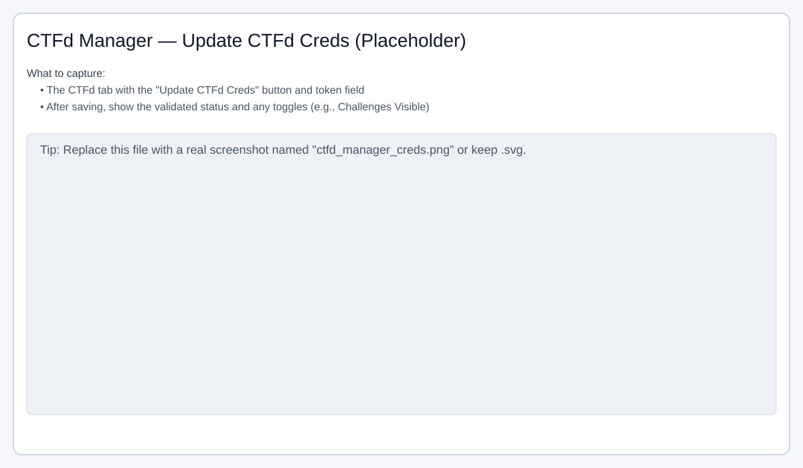
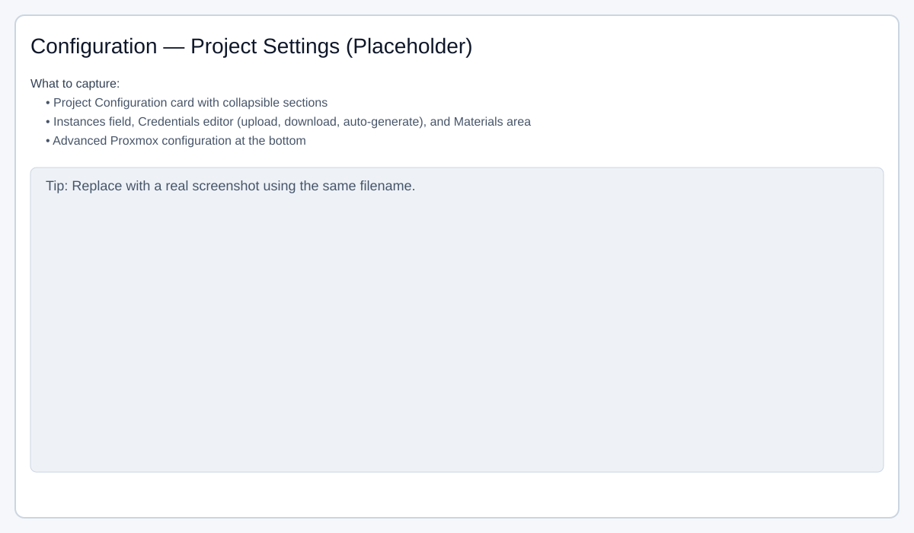
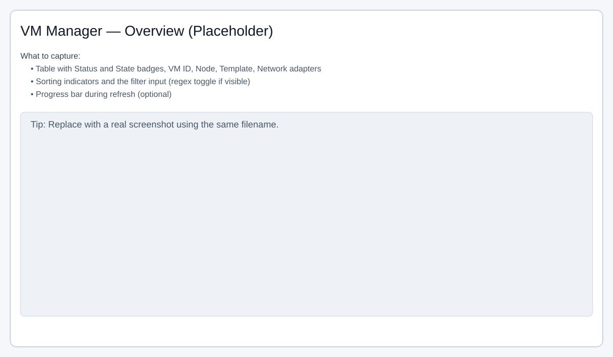
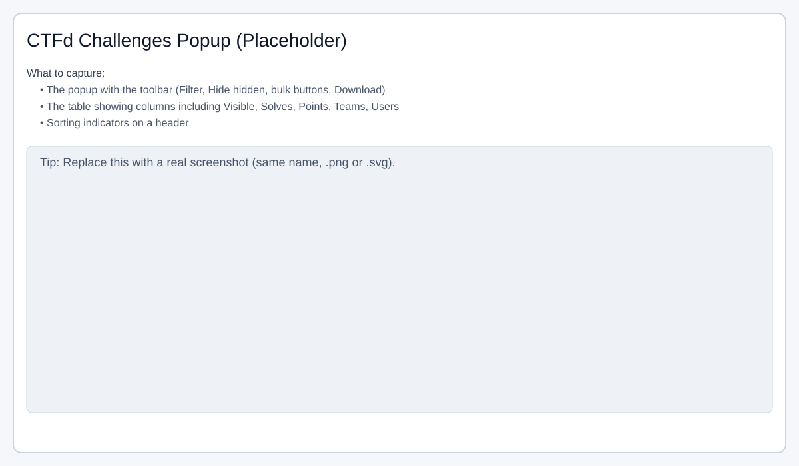
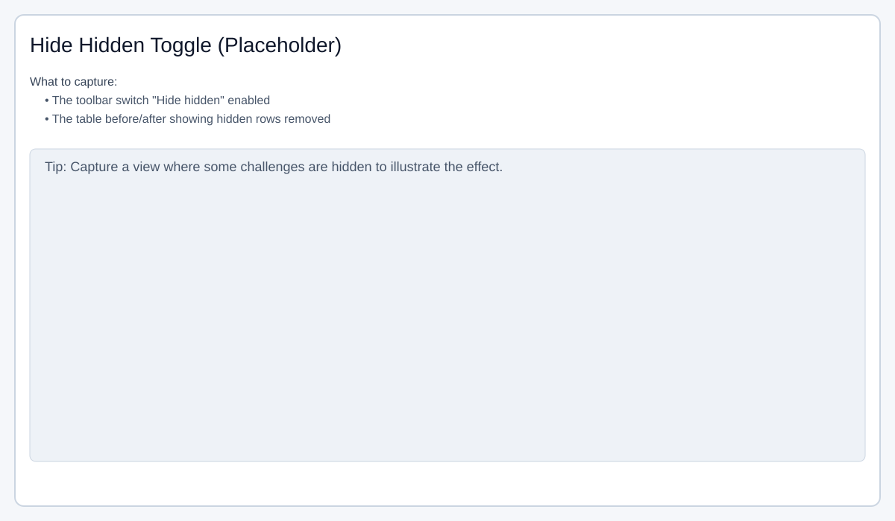
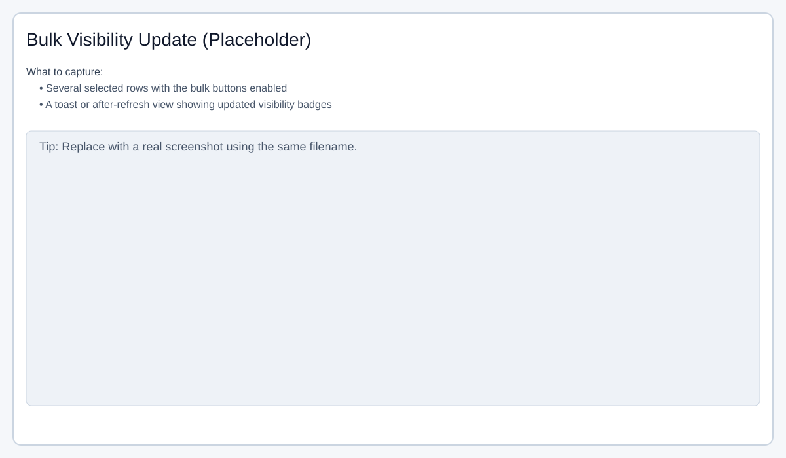

# DeployForge

DeployForge is a Dockerized web UI for configuring CTF/scenario “Projects” and interacting with Proxmox and CTFd via REST APIs. It includes a Bootstrap frontend plus a Flask backend with JSON-backed storage under `DATA_DIR`.

## What you can do

- Create/manage Projects, VMs, Materials, and per-instance Credentials
- Import/export Projects as ZIP bundles (single or multi-project)
- Run Proxmox actions (create/refresh/restore, VM manager UI)
- Manage CTFd settings and challenge visibility (with token-first auth)

Queued actions run on the server in submission order. Once an upload or action
has been accepted, switching pages, refreshing, closing the tab, or signing out
does not stop it. The Queue dock reconnects to your running, waiting, and recent
completed actions on every manager page. Complete VM, guest-transfer, wizard,
and CTFd bulk plans are submitted together, including their follow-up steps.

The queue stores job metadata in `DATA_DIR/action_queue.sqlite3` and streams
queued uploads to `DATA_DIR/queue_uploads` without loading whole files into RAM.
Keep the upload directory alongside the database on persistent storage, with
enough free space for queued files and transfer archives. The push dialog shows
upload progress and stays open until the server accepts the job. No separate
worker service is required. WSGI workers share the scheduler through SQLite. Cancellation removes
waiting work and asks running operations to stop at their next cancellation
check. A server process must remain running to execute work. Interrupted running
actions are marked failed when their worker process disappears and are never
automatically replayed. Submitted request credentials and uploaded queue payloads
are cleared after completion. Direct API clients retain the existing synchronous
endpoints; the web UI submits work through `/api/queue`.

A push batch uploads each selected file to the app once, including selections
across projects. With Proxmox SSH credentials, the app stages one archive per
host and reuses it for that host's selected LXC containers and Linux QEMU VMs.
Guest copies run in parallel, including guests on the same host, up to the
project's Max Jobs setting. The host upload completes once before copying starts. The Queue shows the current upload/download byte percentage and
transferred size, separately from the batch count. Archive preparation and
extraction show indeterminate progress. LXC downloads temporarily stage an
archive in the guest so the download size is known, then remove it. Staged archives are removed when the batch finishes. QEMU host-side
copies require `python3`, `qm`, a working guest agent, and root/sudo access on
the Proxmox host. Without an SSH password, QEMU retains the separate per-guest
API transfer. The host-side QEMU copy uses bounded stdin chunks below the
[Proxmox CLI's 1 MiB limit](https://lists.proxmox.com/pipermail/pve-devel/2020-February/041977.html).

## Quick start (Docker)

Prereqs: Docker + Docker Compose.

```bash
docker compose up --build
```

Open:

- http://localhost (port 80)
- https://localhost (port 443, self-signed cert)

Notes:

- Persistent data lives in `./data` (mounted to `/data` inside the container).
- TLS certs are generated by the `certs` service (set `CERT_DNS` if needed).
- When this stack runs on the same Proxmox host it manages, Proxmox API URLs that use `localhost` or `127.0.0.1` are rewritten inside the container to `host.docker.internal`, and Compose injects the required `host-gateway` mapping.
- The Docker deployment uses a 180-second upstream timeout so large VM inventories have more time to refresh before the reverse proxy gives up.

## Quick start (local dev)

Prereqs: Python 3.12+.

```bash
python3 -m venv .venv
source .venv/bin/activate
pip install -r requirements.txt

export DATA_DIR="$(pwd)/data"
python -m app
```

## Docs

- Getting started: `docs/quickstart.md`
- TLS / certificates: `docs/tls.md`
- Configuration & env vars: `docs/configuration.md`
- Features overview: `docs/features.md`
- Import/export details: `docs/import-export.md`
- Remote mode: `docs/remote-mode.md`
- Auth: `docs/auth.md`
- API reference: `docs/api.md`
- Troubleshooting: `docs/troubleshooting.md`
- Screenshots: `docs/screenshots.md`

Optional:

- Running with `uv`: `UV_USAGE.md`

## License

GPL-3.0 (see `LICENSE`).

Environment variables:
- `AUTH_ENABLE` (default `1`): Set to `0` to disable auth (all /auth endpoints return error and session checks are skipped).
- `SECRET_KEY`: Flask session secret; auto-generated if unset (not persistent across restarts—set it in production).
- `SEED_ADMIN_USER` / `SEED_ADMIN_PASS`: Seed an initial admin user on startup (e.g., `admin` / `changeme123`). If provided, they override the fallback default user.
- `ADMIN_USERS`: Comma-separated list of usernames treated as admins (must still exist in store to log in).
- `USERS_FILE`: Optional path (absolute or relative to DATA_DIR) for the users JSON file (default `users.json`).

First-run default credentials:
- If no users exist and no seed admin is provided, the app creates a temporary administrator account:
	- Username: `setupadmin`
	- Password: `setupadmin`
	- Flag: `must_change=true` (UI shows a red CHANGE PW badge until updated)

Change this password immediately (visit `Users` link or `admin_users.html`).

Auth endpoints (prefix `/auth`):
- `POST /auth/login` {username,password}
- `POST /auth/logout`
- `GET /auth/me` → current user record (or null); includes `must_change` flag
- `POST /auth/users` (admin) create user {username,password,roles:[...],must_change?:bool}
- `GET /auth/users` (admin) list users (excludes password hashes)
- `PATCH /auth/users/{username}` update (self can change own password; admin can also modify roles & must_change)
- `DELETE /auth/users/{username}` (admin) delete user (cannot remove last admin)

Roles: arbitrary strings; `admin` grants elevated actions (user management). Decorators available for future route hardening: `app.login_required`, `app.roles_required('admin')`.

User Administration UI:
- `admin_users.html` provides a simple management panel (list/create/update/delete, password & roles editing).
- Displays a prominent alert if logged in as the default `setupadmin` and password still flagged for change.

Password Change Enforcement:
- Backend tracks a per-user boolean `must_change`.
- Newly auto-seeded `setupadmin` sets `must_change=true`.
- Changing password (PATCH with `password`) clears the flag.

Security Notes:
- Default credential is for first-run convenience only—treat it as compromised until changed.
- API key still required (if configured) for mutating endpoints in addition to session auth.
- This auth subsystem is intentionally minimal; replace with a persistent DB or external IdP (Keycloak, OAuth) for production deployments.

## Using the CTFd Manager & Challenges popup

1) Open the app and select a project, then click the "CTFd" tab.
2) Click "Authenticate to CTFd" and paste an Admin/Teacher API token; Save and let it validate.
3) From the CTFd dropdown, choose "Challenges" to open the popup.
4) In the popup:
- Use the text filter to search across name/category, solves, points, visibility, team/user names, and counts.
- Use the "Include Hidden" switch to show/hide hidden challenges (checked = include hidden).
- Toggle "Regex" to enable regex filtering (invalid patterns fall back to plain text).
- Toggle "Detailed Solves" for full detail; turn it off for faster counts-only mode (Teams/Users show "n/a").
- Select rows and click Set Visible/Set Hidden to bulk update. Per-row buttons also available.
- Download CSV for the current dataset (visibility included).

Notes:
- Sort, filter text, and the Include Hidden / Regex / Detailed Solves toggles are remembered per project for this browser session.
- If you lack permissions, the popup will show hints; ensure the token has sufficient role.

## Screenshots

CTFd Manager — Authenticate to CTFd



Configuration — Project Settings



VM Manager — Overview



Challenges popup — Overview



Challenges popup — Include Hidden toggle



Challenges popup — Bulk visibility update



Tip: Replace the placeholder SVGs with real screenshots (keep filenames). PNGs work too if you update the links.

## Orchestrator access

In VM Manager, select rows and use **Users & Access → Enable orchestration access
(dangerous)** to enroll their existing PVE users in `caf-orchestration` and `caf-maintainers` (including application update/rollback access). A matching
**Disable orchestration access** operation removes enrollment. Both require an
explicit confirmation naming the users; SCE administrators perform the change
using their PVE administration credentials.

Enrollment is user-level, not restricted to the selected rows. Orchestrator 0.6+
limits each user to their PVE-visible VMs and private results. SCE does not assign
ScenarioForge/CoreVM/participant roles or change VM ACLs. See [setup, scope, revocation and tests](docs/orchestration-access.md).


## Per-VM console file transfer

SCE-web manages upload/download policy through the project's existing Proxmox connection. It does not contact `cit_vm_accessor` or need a console URL or certificate configuration. Policies can be enabled or disabled while the console is unavailable or its global transfer switches are off.

`cit_vm_accessor` still requires `ENABLE_VM_FILE_UPLOAD=true` and/or `ENABLE_VM_FILE_DOWNLOAD=true` in its Compose environment to permit actual transfers. Both default to `false`. A direction is allowed only when both its global switch and the VM's Notes policy permit it. SCE-web's controls and arrows indicate VM policy, not the console deployment's global state.

Rebuild/recreate SCE-web after upgrading; recreate the console after changing its global switches:

```bash
# In SCE-web:
docker compose up --build -d app
# In cit_vm_accessor, after changing global transfer switches:
docker compose up --build -d proxclient
```

In **Configuration**, QEMU VM templates marked **User-Accessible** show **Upload** and **Download** checkboxes. Administrators can save these defaults and synchronize them to all existing instance VMs of that template using the active Proxmox credentials or project API token. Failed synchronization is reported; verify live policy in VM Manager after resolving it. New clones receive explicit defaults, and applying scenario notes reapplies them. Unchecking User-Accessible clears both defaults and revokes transfer policy when access is synchronized.

In **VM Manager**, ↑ and ↓ next to the glasses indicate upload/download policy (green enabled, gray disabled). Before live inventory is refreshed, these reflect template configuration; after refresh they reflect each VM's Notes. The operations dropdown provides separate enable/disable actions for each direction, including multi-project selections. These actions modify only selected VM instances, preserve the other direction and template defaults, and refresh the inventory.

Policies are stored as a separate JSON object in Proxmox VM Notes:

```json
{"AccessForge": {"file_upload": true, "file_download": false}}
```

Human notes, scenario metadata and credentials are preserved. Updates use the Proxmox configuration digest when available so concurrent edits are rejected instead of overwritten. Only authorized administrators should edit these policies or have Proxmox VM-note write access.

`cit_vm_accessor` enforces the policy on the server: downloads check it before each chunk; SPICE uploads are inspected by the bridge and checked at transfer start and during transfer. Missing or unreadable policy denies transfers. Existing VMs without policy remain disabled until configured. Reconnect an already-open console after enabling a previously disabled upload policy. SPICE and QEMU guest agents are still required for their respective directions, and download users still need the Proxmox guest-agent file-read privilege. This does not grant new Proxmox privileges or govern clipboard text and external clients.
